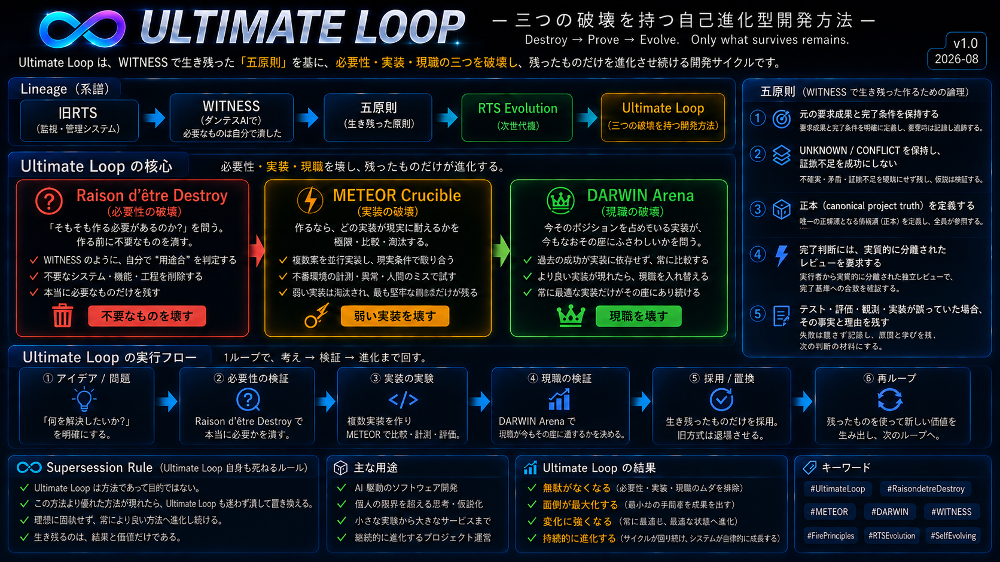

# Ultimate Loop

<div align="center">

**Development Sequence Loop**  
*A self-evolving development method built around three destructions.*



> **百万回死んでも残るものだけ、作るべきである。**  
> **百万回殺せ。なお立つものだけ作れ。**

`PROVISIONAL_OPERATIONAL` · `CANONICAL` · `ACTIVE` · `SELF_EVOLVING`

</div>

---

## What is Ultimate Loop?

**Ultimate Loop** is a development method for deciding:

- whether a responsibility deserves to exist at all;
- which implementation can actually survive reality;
- whether the current incumbent still deserves its slot when reality changes;
- and what evidence, memory, authority boundaries, and recovery capability must survive when implementations, providers, tools, or even the original creator disappear.

It is **not** a framework, model, runtime, product, provider, or permanent architecture.

The protected subject is the **human-important outcome** — not the current implementation.

### Start here

| Document | Purpose |
|---|---|
| [**METHOD.md**](METHOD.md) | Canonical end-to-end method |
| [**THREE_DESTRUCTIONS.md**](THREE_DESTRUCTIONS.md) | Raison d'être Destroy / METEOR / DARWIN |
| [**EXTERNAL_CAPABILITY_FEED.md**](EXTERNAL_CAPABILITY_FEED.md) | Replaceable current-reality / challenger-supply layer for Gate 0 + WATCH/DARWIN |
| [**TRACE_OBSERVATION_LAYER.md**](TRACE_OBSERVATION_LAYER.md) | Passive cross-cutting evidence observation and replay contract |
| [**LINEAGE.md**](LINEAGE.md) | How WITNESS → Five Principles → RTS Evolution → Ultimate Loop happened |
| [**SUPERSESSION_RULE.md**](SUPERSESSION_RULE.md) | Why Ultimate Loop itself has no permanent right to survive |

---

## The Three Destructions

Ultimate Loop was refined during the reconstruction that produced **RTS Evolution**. Its core is not "build faster" — it is **destroy the wrong thing before allowing it to become permanent**.

### 1. Raison d'être Destroy — destroy necessity

> **Should this responsibility exist at all?**

Before building, try to eliminate the need to build.

```text
DROP
→ EXTERNALIZE
→ COMPOSE
→ MANUAL_BOUNDED
→ GLUE
→ IRREDUCIBLE_BUILD
```

**No survival, no build.**

### 2. METEOR Crucible — destroy weak implementations

> **If it must exist, which implementation actually survives reality best?**

The strongest existing/external composition and the smallest justified custom challenger are tested against the **same frozen workload**, evidence requirements, authority boundaries, destructive cases, recovery obligations, and whole-life criteria.

A benchmark win alone is not enough.

### 3. DARWIN Arena — destroy incumbency

> **Even if it survived before, does the incumbent still deserve its slot now?**

Every promoted implementation remains replaceable. A credible challenger, material failure, provider change, cost shift, security event, or era change can reopen the match.

```text
SURVIVE
/ RECOMPOSE
/ PARTIAL_REPLACE
/ FULL_REPLACE
/ DIE
```

**No implementation receives a permanent right to exist.**

→ [Read the full Three Destructions](THREE_DESTRUCTIONS.md)

---

## External Capability Feed

Ultimate Loop now makes the WITNESS-derived "look outside before building/preserving" responsibility explicit as a **replaceable challenger-supply layer**.

It can receive current capability changes from official docs, release feeds, GitHub/package registries, APIs, human research, AI-assisted research, provider-native signals, or other replaceable sources.

It is deliberately **not** a fourth loop, crawler requirement, or promotion engine.

```text
EXTERNAL SIGNAL
→ Current Discovery Sweep / WATCH
→ material candidate only
→ existing Raison d'être / METEOR / DARWIN authority
```

Hard distinctions:

```text
NEW != BETTER
FEED HIT != VERIFIED CAPABILITY
NO FEED HIT != NO EXTERNAL CHANGE
DISCOVERY != PROMOTION AUTHORITY
```

The feed may reduce discovery latency, but a material superiority/replacement claim still requires a current targeted landscape sweep and the existing applicable Ultimate Loop gates.

→ [External Capability Feed contract](EXTERNAL_CAPABILITY_FEED.md)  
→ [DA / Counter-DA](EXTERNAL_CAPABILITY_FEED_DA_2026-08-19.md)

---

## The Five Principles That Survived WITNESS

WITNESS did **not** survive as a software platform. Its final necessity tests destroyed the need for a standing WITNESS implementation, while five semantic protections survived:

1. **Preserve the original requested outcome and completion conditions.**
2. **Preserve `UNKNOWN / CONFLICT`; missing proof must not become success.**
3. **Define what may become canonical project truth.**
4. **Require materially separated review for materially fallible completion judgments.**
5. **Preserve the fact and reason when a test, evaluator, observation, or implementation was defective.**

Those principles became part of the foundation used to reconstruct RTS into **RTS Evolution**. During that reconstruction, the development motion itself was refined into Ultimate Loop.

→ [WITNESS](https://github.com/nobutakayamauchi/WITNESS)  
→ [RTS Evolution](https://github.com/nobutakayamauchi/RTS-Evolution)

---

## Canonical Flow

```text
WISH / PROBLEM / EVENT / EXTERNAL CAPABILITY SIGNAL
→ FROZEN SUBJECT + WORKLOAD
→ CURRENT DISCOVERY SWEEP
→ RAISON D'ÊTRE DESTROY
→ KEEP EXISTING / EXTRACT / COMPOSE / MANUAL_BOUNDED
→ IRREDUCIBLE GAP OR MATERIAL ARCHITECTURE DEFICIT
→ BOUNDED PROTOTYPE / REALITY CANDIDATES
→ METEOR CRUCIBLE
→ PROMOTED SURVIVOR
→ DEPLOY / PUBLISH WHEN APPLICABLE
→ DEPLOYMENT IDENTITY
→ POST-DEPLOY DEBUG / REALITY GATE
→ DEPLOYMENT_VALIDATED / FIX_VALIDATED
→ STABLE CORE / MOVABLE FRAME
→ WATCH + EXTERNAL CAPABILITY FEED
→ PERIODIC CHALLENGER SWEEP + EVENT TRIGGERS
→ MATERIAL FAILURE / BETTER CHALLENGER / ERA CHANGE
→ DARWIN ARENA
→ SURVIVE / RECOMPOSE / PARTIAL_REPLACE / FULL_REPLACE / DIE
→ PHOENIX LINEAGE PRESERVES MEMORY + REGENERATION CAPABILITY
→ repeat
```

TRACE may observe material transitions across this flow without becoming a gate or promotion authority.

Hard reminders:

```text
NO CURRENT LANDSCAPE SWEEP → NO SUPERIORITY CLAIM
EXTERNAL CAPABILITY FEED != FOURTH LOOP
DEPLOYED != OBSERVED_CORRECT
PATCH APPLIED != FIX VALIDATED
NEW OCCUPANT != NEW MEMORY
TRACE OBSERVER != GOVERNOR
```

→ [Canonical method](METHOD.md)  
→ [External Capability Feed](EXTERNAL_CAPABILITY_FEED.md)  
→ [TRACE observation layer](TRACE_OBSERVATION_LAYER.md)

---

## Lineage

```text
Original RTS
   ↓ necessity / reconstruction experiments
WITNESS
   ↓ standalone system necessity destroyed
Five surviving principles
   ↓ reconstruct RTS from existing capabilities + surviving responsibilities
RTS Evolution
   ↓ development motion itself becomes refined
Ultimate Loop
   ↓ three destructions + reality / recovery / continuity discipline
repeat
```

The important point is not that each generation became larger.

The pattern was:

**build → question necessity → destroy → preserve only what survives → reconstruct → refine the reconstruction method itself**

→ [Full lineage](LINEAGE.md)

---

## Ultimate Loop Is Not Immortal

Ultimate Loop is subject to its own rule.

If a demonstrably superior development protocol appears, Ultimate Loop must yield.

```text
ULTIMATE LOOP != IMMORTAL
SUPERIOR PROTOCOL PROVEN → ULTIMATE LOOP YIELDS
```

Supersession must preserve the protected outcome, evidence, failure memory, authority boundaries, and reconstruction capability before operational handover is complete.

→ [Supersession Rule](SUPERSESSION_RULE.md)

---

## Canonical Boundary

This repository is the canonical home for the **method**.

It intentionally does **not** become a new monolith containing every historical experiment, RTS-specific binder, destructive-test fixture, runtime implementation, or reconstruction artifact.

Historical evidence remains where it was produced:

- [Original RTS / reconstruction evidence](https://github.com/nobutakayamauchi/RTS)
- [WITNESS](https://github.com/nobutakayamauchi/WITNESS)
- [RTS Evolution](https://github.com/nobutakayamauchi/RTS-Evolution)
- [TRACE](https://github.com/nobutakayamauchi/TRACE) — replaceable evidence observer / reconstruction substrate

The goal is not to preserve a brand or a codebase forever.

> **Preserve the human-important outcome, the evidence needed to know what happened, the memory of what failed, and the ability to replace what no longer deserves to exist.**
